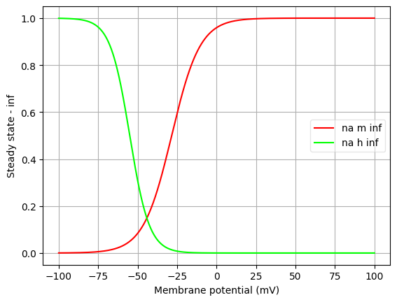
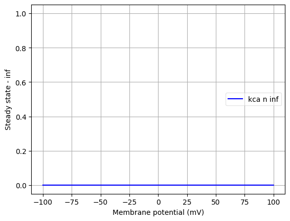
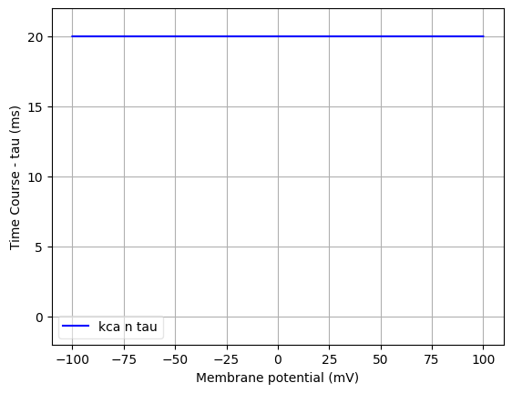
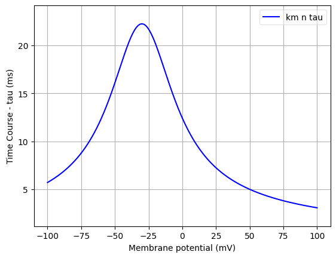
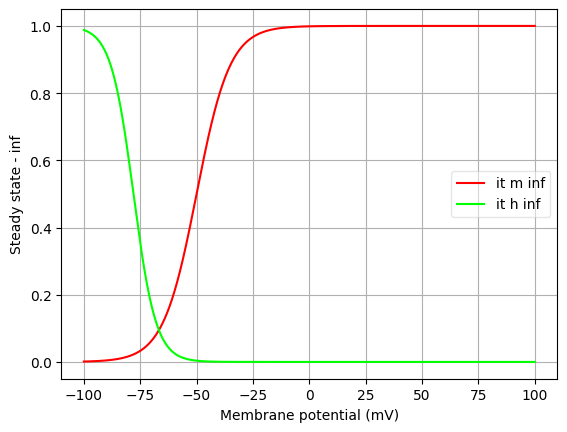
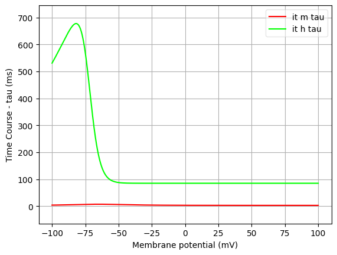

Channel information
===================

Channel information at: T = 34.0 degC, E_rev = 0 mV, [Ca2+] = 0.00043 mM

<h2>na</h2>

Ion: <b>na</b> |
Conductance expression: <b>g = gmax * m3 * h </b> |
NeuroML2 file: <a href="../na.channel.nml">na.channel.nml</a>

Notes
Sodium channel, Hodgkin-Huxley style kinetics.

WARNING: Global parameter "vshift" from modfile has not been implemented.

Comments from original mod file:

26 Ago 2002 Modification of original channel to allow variable time
step and to correct an initialization error.
    Done by Michael Hines(michael.hines@yale.e) and Ruggero
Scorcioni(rscorcio@gmu.edu) at EU Advance Course in Computational
Neuroscience. Obidos, Portugal
11 Jan 2007
    Glitch in trap where (v/th) was where (v-th)/q is. (thanks Ronald
van Elburg!)

na.mod

Sodium channel, Hodgkin-Huxley style kinetics.

Kinetics were fit to data from Huguenard et al. (1988) and Hamill et
al. (1991)

qi is not well constrained by the data, since there are no points
between -80 and -55.  So this was fixed at 5 while the thi1,thi2,Rg,Rd
were optimized using a simplex least square proc

voltage dependencies are shifted approximately from the best
fit to give higher threshold

Author: Zach Mainen, Salk Institute, 1994, zach@salk.edu

<h2>kca</h2>

Ion: <b>k</b> |
Conductance expression: <b>g = gmax * n </b> |
NeuroML2 file: <a href="../kca.channel.nml">kca.channel.nml</a>

Notes
Comment from original mod file: Calcium-dependent potassium channel,
                    Based on Pennefather (1990) -- sympathetic ganglion cells,
                    taken from Reuveni et al (1993) -- neocortical cells
                    Author: Zach Mainen, Salk Institute, 1995, zach@salk.edu
        

<h2>km</h2>

Ion: <b>k</b> |
Conductance expression: <b>g = gmax * n </b> |
NeuroML2 file: <a href="../km.channel.nml">km.channel.nml</a>

Notes
Potassium channel, Hodgkin-Huxley style kinetics
	
Comments from original mod file:

26 Ago 2002 Modification of original channel to allow variable time step and to correct an initialization error.
    Done by Michael Hines(michael.hines@yale.e) and Ruggero Scorcioni(rscorcio@gmu.edu) at EU Advance Course in Computational Neuroscience. Obidos, Portugal

km.mod

Potassium channel, Hodgkin-Huxley style kinetics
Based on I-M (muscarinic K channel)
Slow, noninactivating

Author: Zach Mainen, Salk Institute, 1995, zach@salk.edu
	

<h2>kv</h2>

Ion: <b>k</b> |
Conductance expression: <b>g = gmax * n </b> |
NeuroML2 file: <a href="../kv.channel.nml">kv.channel.nml</a>

Notes
Potassium channel, Hodgkin-Huxley style kinetics
	
Comments from original mod file:

26 Ago 2002 Modification of original channel to allow variable time step and to correct an initialization error.
    Done by Michael Hines(michael.hines@yale.e) and Ruggero Scorcioni(rscorcio@gmu.edu) at EU Advance Course in Computational Neuroscience. Obidos, Portugal

kv.mod

Potassium channel, Hodgkin-Huxley style kinetics
Kinetic rates based roughly on Sah et al. and Hamill et al. (1991)

Author: Zach Mainen, Salk Institute, 1995, zach@salk.edu
	

<h2>it</h2>

Ion: <b>ca</b> |
Conductance expression: <b>g = gmax * m2 * h </b> |
NeuroML2 file: <a href="../it.channel.nml">it.channel.nml</a>

Notes
T-type Ca channel

WARNING: Global parameter "vshift" from modfile has not been implemented.

Comments from original mod file:

T-type Ca channel
ca.mod to lead to thalamic ca current inspired by destexhe and huguenrd
Uses fixed eca instead of GHK eqn
changed from (AS Oct0899)
changed for use with Ri18  (B.Kampa 2005)
	

<h2>ca</h2>

Ion: <b>ca</b> |
Conductance expression: <b>g = gmax * m2 * h </b> |
NeuroML2 file: <a href="../ca.channel.nml">ca.channel.nml</a>

Notes
HVA Ca Current
	
WARNING: Global parameter "shift" from modfile has not been implemented. 

Comments from original mod file  
 26 Ago 2002 Modification of original channel to allow variable time step and to correct an initialization error.
    Done by Michael Hines(michael.hines@yale.e) and Ruggero Scorcioni(rscorcio@gmu.edu) at EU Advance Course in Computational Neuroscience. Obidos, Portugal

ca.mod
Uses fixed eca instead of GHK eqn

HVA Ca current
Based on Reuveni, Friedman, Amitai and Gutnick (1993) J. Neurosci. 13:
4609-4621.

Author: Zach Mainen, Salk Institute, 1994, zach@salk.edu
	

