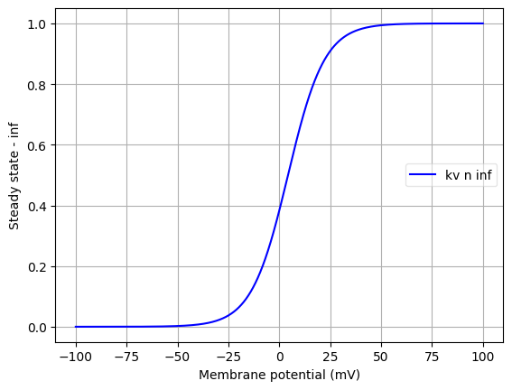
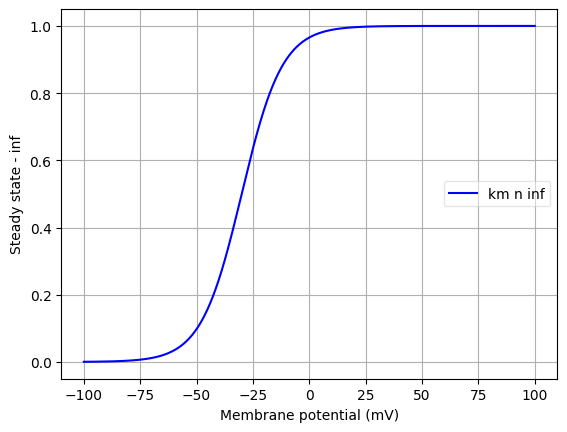

Channel information
===================

Channel information at: T = 35.0 degC, E_rev = 0 mV, [Ca2+] = 0.00043 mM

<table>
    <tr>
<td width="120px">
            <b>it</b> 
            <a href="../it.channel.nml">it.channel.nml</a> 
            <b>Ion: ca</b> 
            <i>g = gmax * m2 * h </i> 
            ...
</td>
<td>

</td>
<td>

</td>
</tr>
<tr>
<td width="120px">
        <b>ca</b> 
        <a href="../ca.channel.nml">ca.channel.nml</a> 
        <b>Ion: ca</b> 
        <i>g = gmax * m2 * h </i> 
        ...
</td>
<td>

</td>
<td>

</td>
</tr>
<tr>
<td width="120px">
        <b>na</b> 
        <a href="../na.channel.nml">na.channel.nml</a> 
        <b>Ion: na</b> 
        <i>g = gmax * m3 * h </i> 
        ...
</td>
<td>

</td>
<td>

</td>
</tr>
<tr>
<td width="120px">
        <b>kv</b> 
        <a href="../kv.channel.nml">kv.channel.nml</a> 
        <b>Ion: k</b> 
        <i>g = gmax * n </i> 
        ...
</td>
<td>

</td>
<td>

</td>
</tr>
<tr>
<td width="120px">
        <b>km</b> 
        <a href="../km.channel.nml">km.channel.nml</a> 
        <b>Ion: k</b> 
        <i>g = gmax * n </i> 
        ...
</td>
<td>

</td>
<td>

</td>
</tr>
</table>
